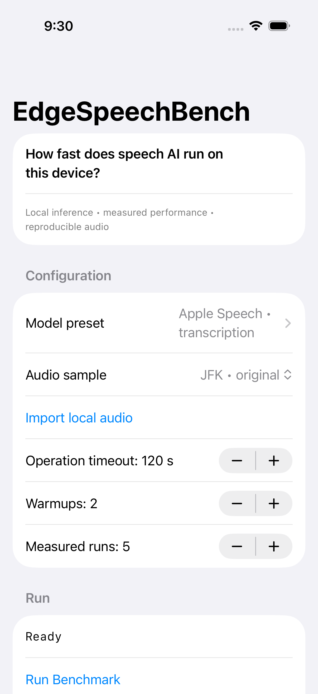
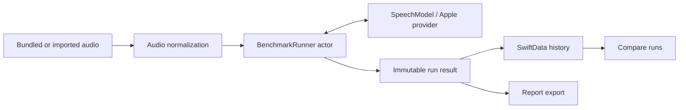

# EdgeSpeechBench

**Measure the cost of on-device speech transcription before deciding whether it fits an iPhone workflow.**

A successful transcript does not tell an engineer how long initialization takes, whether repeated file sessions keep pace with the audio, or how much memory the app consumes. Those boundaries matter when evaluating local speech processing under device and thermal constraints.

EdgeSpeechBench makes them inspectable: it runs repeatable audio fixtures through Apple's SpeechTranscriber, separates provider-cold and warm measurements, saves run context locally and exports reports for comparison. Its value is the measurement harness and explicit methodology; no physical-iPhone benchmark results have been collected in this repository yet.

<p align="center">
  
</p>

*Existing simulator capture before a run: this shows configuration, not performance evidence.*

## What a run measures

```text
Normalize audio and verify installed assets (outside measured timing)
    → fresh-provider load + runtime preparation + first file inference
    → excluded warmups (default: 2)
    → repeated measured file sessions (default: 5)
    → statistics + device context + optional fixture WER
    → local history, comparison and JSON / CSV / text export
```

Warm sessions include new analyzer preparation, decoding, inference and finalization. These are file-session measurements, not an isolated neural-network kernel benchmark or a live microphone-stream latency test. Apple's system caches cannot be flushed: **provider-cold is not guaranteed OS-cold**. See [benchmark methodology](docs/benchmark-methodology.md).

| Output | Interpretation and boundary |
|---|---|
| Load, preparation, first inference, cold total | Separate initialization costs from repeated sessions |
| Warm median, mean, min/max, nearest-rank p95, sample standard deviation | Describe repeatability; default five samples are a small sample, not a capacity study |
| Real-time factor | Warm median divided by decoded audio duration |
| Baseline, sampled peak and endpoint memory | App-process physical footprint, sampled every 100 ms; not total model/system memory or a guaranteed absolute peak |
| Device/OS/build and thermal context | Context for comparing runs, not control over all system conditions |
| Optional word error rate | Fixture reference versus transcription; the small corpus does not establish general speech accuracy |

Unavailable model size/version and exact hardware placement are labelled as unavailable. Details: [metrics](docs/metrics.md), [memory measurement](docs/memory-measurement.md), [accuracy](docs/accuracy.md) and [limitations](docs/limitations.md).

## A runner independent of persistence



Actor services own normalization, inference and sampling. The runner emits progress and returns a result after resource cleanup; it never imports SwiftData. Main-actor state coordinates the UI and persistence. Cancellation and errors stop sampling and unload the provider. See [runner source](EdgeSpeechBench/Benchmark/BenchmarkRunner.swift), [architecture](docs/architecture.md), [errors](docs/errors.md) and [decisions](docs/decisions/).

## Reproduce a comparison

Open `EdgeSpeechBench.xcodeproj` in the compatible Xcode toolchain; the project targets iOS 26.5. Configure signing for a supported physical device. Install English assets through the separate action, select a fixture, run the benchmark, then inspect History and export the report.

Three bundled fixtures use a JFK excerpt, repetition and reduced amplitude. Reports store the normalized input SHA-256, decoded duration/rate/channels and configuration. Use the same physical device, Release build, settings and cool foreground conditions for comparisons. [Fixture provenance](docs/audio-samples.md) documents the input and licensing.

The standard and alternatives presets configure the same Apple en-US model. There is no independent third-party model comparison yet. Imported audio expands inputs, not the available model providers.

## Verification and the remaining evidence gap

The [verification record](docs/verification.md) reports successful Release static analysis and a simulator suite with 11 passes, one real-model integration skip and no failures. Harness tests cover statistics, normalization, persistence, exports, deadlines and cancellation. Test-provider timings validate orchestration, not Apple speech performance.

Physical-device latency, RTF, memory and WER results remain pending. A signed device run and exported result corpus are the next evidence needed; simulator success cannot substitute for them.

## Local processing and scope

Benchmarking requires installed assets and uses local speech processing. Asset installation may download Apple's model. SwiftData history has CloudKit disabled; there is no account, analytics or audio/transcript upload path. Exports contain benchmark metadata rather than audio or transcript content. See [privacy](docs/privacy.md).

Hardware/runtime support varies. Exact accelerator placement, system-wide model memory and OS-enforced termination are outside the harness's observable guarantees. An independent Core ML provider and a broader speaker/language corpus remain future work.
