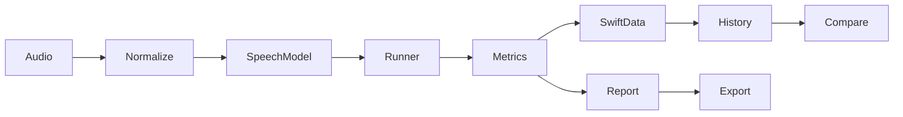

# EdgeSpeechBench

**How fast does speech AI actually run on an iPhone?**

A small local iOS engineering showcase measuring real on-device speech file-session
performance with Swift, SwiftUI, SwiftData, AVFoundation and Apple's SpeechAnalyzer.

## Problem
A transcription alone says little about initialization cost, repeatability, realtime
processing or resource usage. This app records those boundaries and their limits.

## Architecture

The runner never imports SwiftData. Actor services own audio and inference;
main-actor views receive step updates and one immutable result after cleanup.

## Benchmark methodology
One fresh-provider cold run → configurable excluded warmups (default 2) → repeated
measured file sessions (default 5). Normalization and asset download are excluded.
Load, runtime preparation and first inference are separate. Warm sessions include
new analyzer preparation, file decoding, inference and finalization. System model
caches are not flushable: provider-cold does not guarantee OS-cold.

## Metrics
Cold boundaries; warm median/mean/min/max/nearest-rank p95/sample standard deviation;
RTF = warm median / decoded audio duration; baseline/100 ms sampled peak/endpoint
app footprint; device/OS/build and coarse thermal context; optional fixture WER.
Unavailable model size/version and exact hardware placement are labelled honestly.

## Example results
No physical-iPhone benchmark numbers have been produced in this repository yet.
Run a session and export its JSON/CSV/text report to obtain real results. No example
numbers are substituted. Simulator verification cannot establish iPhone performance.

## Models and on-device inference
Apple SpeechTranscriber en-US, standard or alternatives preset (same model, different
configuration). No third-party inference dependency, training or conversion pipeline.
Install English assets using the separate action; benchmarking requires installed
assets and uses local speech processing. Hardware/runtime support varies.

## Swift / SwiftUI / SwiftData
Existing Xcode project, Swift 5 language mode, iOS 26.5 target and identifiers remain.
SwiftUI Forms expose run/cancel, import, history, comparison, detail and Files export.
SwiftData stores versioned benchmark snapshots locally with CloudKit explicitly off.
Existing Item data and CRUD remain accessible.

## Reproducibility
Three fixed bundled speech fixtures: JFK excerpt, three repetitions, and reduced
amplitude. Input SHA-256, decoded duration/rate/channels and configuration are stored.
Use the same physical device, release build, cool foreground conditions and settings
for meaningful comparisons. See [fixture provenance](docs/audio-samples.md).

## Privacy
No audio/transcript uploads, account, analytics or CloudKit. Explicit asset installation
may download Apple's model. Exports contain only benchmark metadata. See
[privacy](docs/privacy.md) and [limitations](docs/limitations.md).

## Build and verification
Open `EdgeSpeechBench.xcodeproj` in the existing Xcode toolchain. Run the app on a
compatible physical device, install English assets, choose a fixture and Run Benchmark.
Tests are intentionally deferred until all 32 implementation phases are committed.
Final verification evidence and screenshots are added after that gate.

## Documentation
[Architecture](docs/architecture.md) · [Methodology](docs/benchmark-methodology.md) ·
[Audio](docs/audio-pipeline.md) · [Inference](docs/inference.md) · [Metrics](docs/metrics.md) ·
[Memory](docs/memory-measurement.md) · [SwiftData](docs/swiftdata.md) ·
[Decisions](docs/decisions)

## Roadmap
Independent Core ML model provider, selectable configured compute units when exposed,
more speakers/languages and a larger ground-truth corpus, physical-device result corpus.
